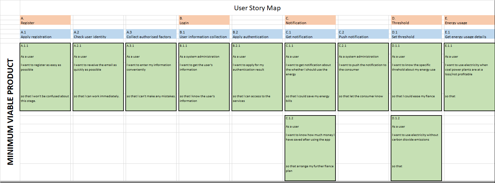
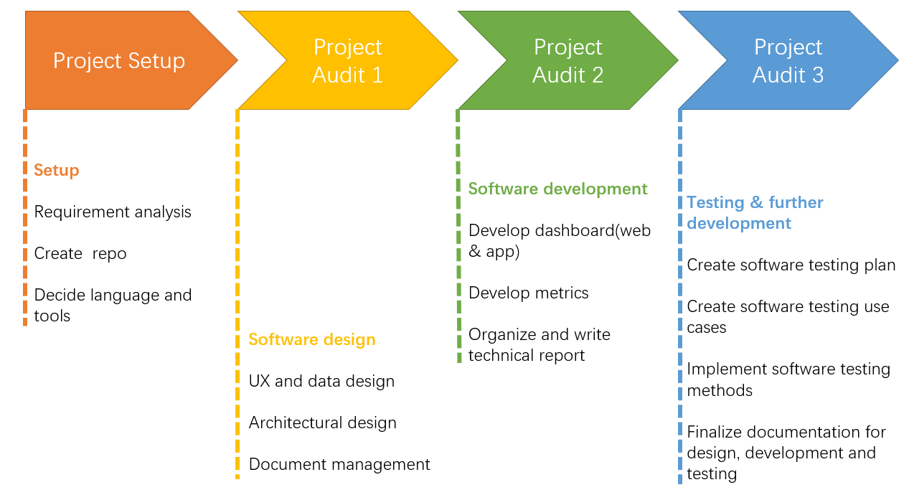

Table of Contents
=================
- [Background](#Background)
- [Tools and Skills related](#Tools_and_Skills_related)
- [Requirement](#Requirement)
- [Identification of Resources, Risks, Potential Costs](#Identification_of_Resources_Risks_Potential_Costs)

- [Role and Responsibility](#Role_and_Responsibility)

- [Schedule and Due date](#Schedule_and_Due_date)

- [Appendix](#Appendix)

## 1 Background

### 1.1 Problem

In recent years, climate change has become a global issue that affects human life. However, many government actions are perpetually 20 years late to protect the environment. On the other side, it is annoying for people to face high energy bills every month but they do not know what to do. Besides, in Australia, it is estimated that grids dominated by coal will be retired around 2040, and it is quite hard to replace coal energy by using fully renewable energy nowadays.

### 1.2 Solution

First, we will check the things that we need to do. Second, after communicating with the client, we decide to make a product with multiple platforms which is easy for people to have an impact, like let people know if it is a good time to use more or less power, provide some advice to save money. Third, this product should provide very simple information, maybe just a number or a color, even a 10-year-old child can understand the meaning. Fourth, this product should have no annoying notification, Also, giving the user feedback is important, this product will tell the user what is the good behavior, and reward the good behavior in time.

## 2 Tools and Skills related

### 2.1 Project Management Tools

- Slack, WeChat (General Q&A)
- Monday (Task management)
- Github (Code branch)
- Google Drive (Document)
- Zoom (Meeting)

### 2.2 Development Tools

#### 2.2.1 Programming Language

Java and most likely a combination of Python and JavaScript.

#### 2.2.2 Testing

- Unit test during development by black/white box.

- A/B test for the final stage.

## 3 Requirement

### 3.1 Product Functions

The primary goal of this project is to create a real-time web-based data dashboard, for time strapped energy users. Forecasting of when is the best time for consumers to use energy. Displaying the most important and actionable metrics will allow consumers to discover strategies to reduce their bills. In addition, it will be possible to switch between different metrics to find the most appropriate energy usage for consumers in the future.

### 3.2 General Constraints

- The back-end of the program will be based on Java
- The web-based front-end should utilize HTML, CSS and JavaScript
- The program can process the data from clients’ company
- The input data includes pure energy usage data

### 3.3 Specific Requirements

#### 3.3.1 Identification Methods

- The model used should be able to recommend reasonable energy usage status prompts to users in real time through the calculation of energy indicators assigned weights.
- The program should be able to recommend more reasonable energy use options to users based on metric and location.
- The program may provide customized energy use solutions based on user expectations.

#### 3.3.2 System Output

- The program should display the prompt of energy use status and scores of each evaluation index in the front end.
- The program needs to refresh the existing user interface to achieve real-time performance.

#### 3.3.3 System Input

- The program should be able to process energy data collected from smart devices.

- The model developed should use the existing energy data set of news as the training set provided by the client.

### 3.4 Minimum Viable Product (MVP) 

#### 3.4.1 An Operational Website

- The program should at least implement.
- The requirement in 3.3.2 System Output to Calculate and display energy usage tips for input energy data in a simpler and clearer way, and list them at the front-end.
- The requirements in 3.3.3 System Input, be able to receive the latest energy data.

#### 3.4.2 Appropriate Algorithms in Data Analysis

Our team is committed to applying and improving some of the current open source data analysis algorithms.

#### 3.4.3 User Survey Report

User surveys play an important role in both front-end and back-end development and how algorithms work. For this project, our goal was to get feedback on different types of households, understanding the level of energy consumption in each household and the proportion of energy bills in each household, which would help us design the project and improve the user experience on the site.

## 4 Identification of Resources, Risks, Potential Costs

### 4.1 Resources

- Team members’ laptops used for data processing
- Team members’ laptops used for software developing
- The web development frames
- Dataset about different types of energy use

### 4.2 Risks

- The risk of failing to achieve the expected accuracy and efficiency
- The risk of failure to final integrate due to the disunity of work division
- The risk of timeouts which leads to the failure of debugging and final deliverable
- The risk of failing to respond to the feedback from the user survey

### 4.3 Risks Management

- Review work every 2 weeks. If any process is falling behind, try switch methods/ add additional workload/ adjust team structure

- Conduct First user survey early (in week 5), so the team will have sufficient time to deal with user feedback
- Communicate with stakeholders weekly

### 4.4 Potential Costs

- Budget for entity legal documentation and licenses. The client will bear it.
- Budget for purchasing web development frames. The client will bear it.
- Time used for the whole project. All team members will bear it.
- The commuting and depreciation fee for meeting and development. All team members will bear it.

## 5 Role and Responsibility

| Name           | Uni ID   | Role                                   |
| -------------- | -------- | -------------------------------------- |
| Yun  Huang     | u6766683 | Back-End Developer,  Spokesperson      |
| Alex  Xiu      | u6820664 | Front-End Developer,  Spokesperson     |
| Hao  Cao       | u6807681 | Back-End Developer,  Database designer |
| Haonan  Liu    | u6762898 | Front-End Developer                    |
| Zixin  Ye      | u6605822 | Front-End Developer,  Documentation    |
| Mingchao  Sima | u6502811 | Developer                              |
| Jie  Zou       | u6849083 | Developer                              |

 

## 6 Schedule and Due date

### 6.1 Schedule

| Time              | Plan                                                         |
| ----------------- | ------------------------------------------------------------ |
| Week  01          | ●      Form team                                             |
| Week  02          | ●      Divide roles   ●      Confirm requirements with clients   ●      Decide schedule and milestones   ●      Risk management |
| Week  03          | ●      Project Audit 01   ●      Finished legal issues   ●      Set up the development environment   ●      Improve and finalise the SOE   ●      Search for related information |
| Week  04          | ●      Design web UI   ●      Design Database structure (with E-R)   ●      Mockup   ●      Start coding |
| Week  05          | ●      Improved website functions   ●      Improved data analysis algorithm |
| Week  06          | ●      Audit 02   ●      Coding                          |
| Teaching  Break-1 | ●      Coding                                                |
| Teaching  Break-2 | ●      Coding                                                |
| Week  07          | ●      Compared among different data analysis algorithm   ●      Test & Debug   ●      Adjusting UI and functions according to reflection   ●      Conduct the first user feedback |
| Week  08          | ●      Conduct the second user survey   ●      Analyse and reflect to survey report   ●      Keep improving UI interface according to reflection   ●      Keep improving the data analysis algorithms according to reflection |
| Week  09-10       | ●      Audit 03   ●      Accomplish final deliverable   ●      Design poster   ●      Showcase   ●      Adjusting UI and functions according to reflection |
| Week  11-12       | ●      Finish handover documents   ●      Report to client |

**Gantt Chart**

# 

### 6.2 Due Date

The client does not propose any due day so we will follow the due day of this course to arrange our project (https://cs.anu.edu.au/TechLauncher/dates/)

## Appendix

### User Story Map

### Roadmap

# 

### Milestones

### Decision Making

[Decision Making Log](https://drive.google.com/open?id=19k1Fsmo4KuVd94mFDShupvla8UwJ114F)

### Meeting Agenda

#### [Client Meeting](https://drive.google.com/drive/u/0/folders/1JDLw-aj0xIpS0n6nQhEs_xYXsJeqq_1z)
#### [Group Meeting](https://drive.google.com/drive/u/0/folders/1BSpx8gMwuLM7Ho7e31pjJPzcxYUEbgdz)

### Other Resources

#### [Google Drive](https://drive.google.com/drive/u/0/folders/1y3KpK8C18bNmg2Vh6dXU8p4_0ZtfzpBJ)

